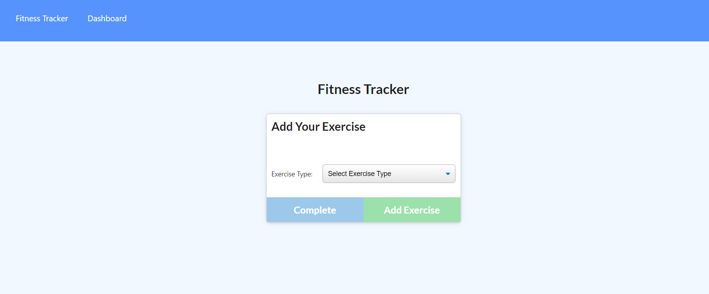

#  WorkOut-Tracker
 
  ## Description
  This app allows us to keep track of our work outs and update the work outs.
  ## author
  Sakaria Ahmed

  ## Table of Contents
  - [Installation](#installation)
  - [Usage](#usage)
  - [dependencies](#dependencies)
  - [Screenshot](#ScreenShot)
  - [Test](#tests)
  
  - [Questions](#Question)
  - [Additional](#additional)

  ## Installation
  npm i
  
  ## Usage

  This app allows us to keep track of our work outs and update the work outs.

  HTML,Javacript,Node,CSS

  ## Dependencies
  express, morgan, mongoose

  ## Screenshot
  
  
  ## Tests
  npm test

  
  

  ## Contact
  For further contact information, contact me here:
  * Email Address: ahmedsakaria32@gmail.com
  * GitHub: [SakariaQcorp](https://github.com/SakariaQcorp)
  
  ## Any additional information
  To See the application in action click the link below.
  [Application](https://workout-tracker-app21.herokuapp.com/)
  

  
